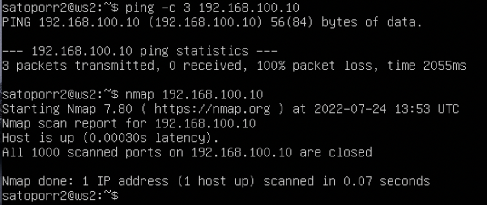
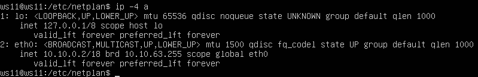
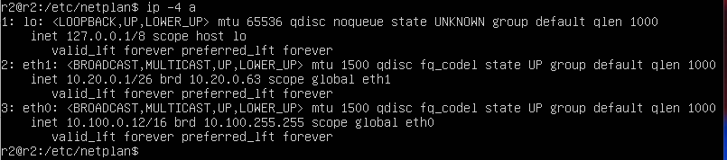
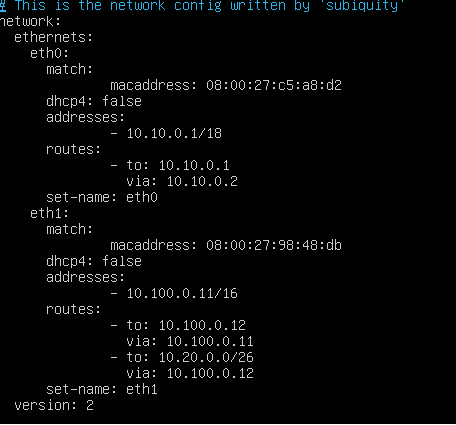
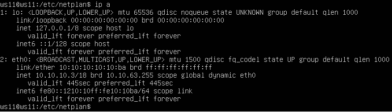
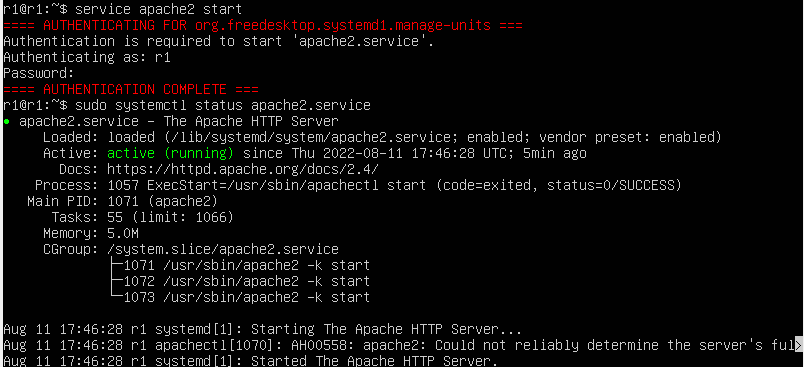

1. [Part-1. Инструмент ipcalc](#Part-1.-Инструмент-ipcalc)
2. [Part-2. Статическая маршрутизация между двумя машинами](#part-2-статическая-маршрутизация-между-двумя-машинами)
3. [Part-3. Утилита iperf3](#part-3-утилита-iperf3)
4. [Part-4. Сетевой экран](#part-4-сетевой-экран)
5. [Part-5. Статическая маршрутизация сети](#part-5-статическая-маршрутизация-сети)
6. [Part-6. Динамическая настройка ip с помощью dhcp](#part-6-динамическая-настройка-ip-с-помощью-dhcp)
7. [Part-7. NAT](#part-7-nat)
8. [Part-8. Дополнительно знакомство с ssh tunnels](#part-8-дополнительно-знакомство-с-ssh-tunnels)

## Part 1. Инструмент ipcalc

#### 1.1. Сети и маски
- Адрес сети 192.167.38.54/13 - 192.160.0.0.
- Маска 255.255.255.0 в префиксной записи /24, в двоичной - 11111111.11111111.11111111.00000000.
- Маска /15 в обычной записи - 255.254.0.0, в двоичной - 11111111.11111110.00000000.00000000.
- Маска 11111111.11111111.11111111.11110000 в обычной записи - 255.255.255.240, в префиксной записи - 28.
-Минимальный и максимальный хост в сети 12.167.38.4:
    1) маска /8: 12.0.0.1 - 12.255.255.254 
    2) маска 11111111.11111111.00000000.00000000: 12.167.0.1 - 12.167.255.254;
    3) маска 255.255.254.0:  12.167.38.1 - 12.167.39.254;
    4) маска /4: 0.0.0.1 - 15.255.255.254.

#### 1.2. localhost
- localhost (так называемый, «местный» от англ. local, или «локальный хост», по смыслу — этот компьютер) — в компьютерных сетях, стандартное, официально зарезервированное доменное имя для частных IP-адресов (в диапазоне 127.0.0.1 — 127.255.255.254, RFC 2606).
- Можно обратиться к приложению, работающему на localhost, со следующими IP:
    1) 127.0.0.2;
    2) 127.1.0.1.
- С IP 194.34.23.100 и 128.0.0.1 - нельзя.

#### 1.3. Диапазоны и сегменты сетей
- IP можно использовать в качестве публичного:
    1) 134.43.0.2;
    2) 172.0.2.1;
    3) 192.172.0.1;
    4) 172.68.0.2;
    5) 192.169.168.1.
- IP можно использовать в качестве частного:
    1) 10.0.0.45;
    2) 192.168.4.2;
    3) 172.20.250.4;
    4) 172.16.255.255;
    5) 10.10.10.10.
- У сети 10.10.0.0/18 возможны следующие  IP адреса шлюза (диапазон адресов сети от 10.10.0.1 до 10.10.63.254):
    1) 10.10.0.2;
    2) 10.10.10.10;
    3) 10.10.1.255.
- У сети 10.10.0.0/18 следующие  IP адреса не могут быть использованы в качестве IP адреса шлюза:
    1) 10.0.0.1;
    2) 10.10.100.1;

    ## Part 2. Статическая маршрутизация между двумя машинами
- На двух виртуальных машинах (далее -- ws1 и ws2) с помощью команды ip a можно посмотреть существующие сетевые интерфейсы: \
 \
Вывод команды ip a на двух виртуальных машинах (верхний - ws1, нижний - ws2)
- Задать следующий адрес и маску - 192.168.100.10, маска /16, для ws1 можно изменив файл etc/netplan/00-installer-config.yaml. \
 \
Изменённый файл etc/netplan/00-installer-config.yaml для - ws1
- Задать следующий адрес и маску - 172.24.116.8, маска /12, для ws2, изменив аналогичный файл: \
 \
Изменённый файл etc/netplan/00-installer-config.yaml для - ws2
- Для перезапуска сервиса сети необходимо выполнить команду sudo netplan apply на обеих машинах: \
 \
Вызов команды netplan apply на машине ws1 \
 \
Вызов команды netplan apply на машине ws2

#### 2.1. Добавление статического маршрута вручную
- Добавление статического маршрута от ws1 до ws2 ip r add: \
 \
Вызов команды netplan apply на машине ws1
- Добавление статического маршрута от ws2 до ws1 ip r add: \
 \
Вызов команды netplan apply на машине ws2
- Пропинговать соединение между машинами \
 \
Вызов команды ping на машине ws1 \
 \
Вызов команды ping на машине ws2

#### 2.2. Добавление статического маршрута с сохранением
- После перезапуска машин, добавить статический маршрут от одной машины до другой можно с помощью файла etc/netplan/00-installer-config.yaml \
 \
Изменённый файл etc/netplan/00-installer-config.yaml для машины ws1 \
 \
Изменённый файл etc/netplan/00-installer-config.yaml для машины ws2 \
- После этого можно пинговать соединение между машинами \
 \
Вызов команды ping на машине ws1 после изменения файла etc/netplan/00-installer-config.yaml \
 \
Вызов команды ping на машине ws2 после изменения файла etc/netplan/00-installer-config.yaml

## Part 3. Утилита iperf3
- Для выполнения этого задания неободимо установить утилиту iperf3 на обоих машинах с помощью команды sudo apt-get install.
#### 3.1. Скорость соединения
- Базовой единицей скорости передачи информации является бит в секунду (бит/с).
Разница между байтами в секунду (Б/с) и битами в секунду такая же, как разница между байтами и битами: 1 Б/с = 8 бит/с.
Точно так же разница между килобайтами в секунду (КБ/с) и Б/с такая же, как разница между килобайтами и байтами: 1 КБ/с = 1024 Б/с.
- К примеру: 
    1) 8 Mbps - 1 MB/s;
    2) 100 MB/s - 819200 Kbps (1MB/s = 1024KB/s = 1024 * 8 Kbps );
    3) 1 Gbps - 1024 Mbps.
#### 3.2. Утилита iperf3
- Для измерения скорости соединения между ws1 и ws2 можно воспользоваться утилитой iperf3. В режиме сервера, используя флаг -s , запускается утилита на одной машине (по умолчанию он будет прослушивать порт 5201). Далее на второй машине (запущенной как клинт) запускается iperf3 с флагом -c и указанием адреса сервера (в нашем случае IP-адрес). Должны использоваться результаты, полученные с клинтского компьютера \
 \
Результаты измерения скорости на машине ws2 \
 \
Результаты измерения скорости на машине ws1

## Part 4. Сетевой экран
- Для контроля информации, проходящей по соединению, используются сетевые экраны.
#### 4.1. Утилита iptables
- Создан файл /etc/firewall.sh, имитирующий фаерволл, на ws1:
    1) открыт доступ на порты 22 и 80;
    2) запрет echo reply (машина не должна "пинговаться”);
    3) разрешение echo reply (машина должна "пинговаться”).
 - Создан файл /etc/firewall.sh, имитирующий фаерволл, на ws2:
    1) открыт доступ на порты 22 и 80;
    2) разрешение echo reply (машина не должна "пинговаться”);
    3) запрет echo reply (машина должна "пинговаться”). \
 \
Содержимое файла /etc/firewall.sh на машине ws1 (верхнее изображение) и на ws2 (нижнее изображение)
- Запустить файлы на машинах ws1 и ws2 можно  командамами chmod +x /etc/firewall.sh и sh /etc/firewall.sh \
 \
Запуск файла /etc/firewall.sh на машине ws1 \
 \
Запуск файла /etc/firewall.sh на машине ws2
- При применении правил в файле firewall.sh на машине ws1 машина выполняет команду, которая запрещает echo reply и машина не "пингуется". А машина ws2 - наоборот \
 \
Ping адресов 192.168.100.10 (не пингуестся) и 172.24.116.8 - пингуется
- На машине ws1 вывод ping сначала запрещен , а затем разрешен . На машине ws2 вывод ping сначала разрешен , а затем запрещен . Приоритет всегда у правила, которое стоит выше. Как только первое правило подходит под условие, дальше список правил уже не смотрится. Соответственно, если написано 2 взаимоисключающих правила - работает первое, второе игнорируется
#### 4.2. Утилита nmap
- Из предыдущего изображения видно, что машина с адресом 192.168.100.10 не пингуется. Утилита nmap показывает, что хост запущен. \
 \
Хост с адресом 192.168.100.10 в утилите nmap имеет статус "Host is up"

## Part 5. Статическая маршрутизация сети
- Запускается 5 машин: 3 рабочие станции (ws11, ws21, ws22) и 2 роутера (r1, r2).
#### 5.1. Настройка адресов машин
- Настройка  конфигурации машин в etc/netplan/00-installer-config.yaml. Рабочая станция ws11 (ip адрес 10.10.0.2/18) по интефейсу eth0 подключается к роутеру r1 (ip адрес 10.10.0.1/18) - сеть 10.10.0.0/18. \
 \
Конфигурация машины ws11 в etc/netplan/00-installer-config.yaml
- После перезапуска сервиса сети, командой "ip -4 a", можно проверить, что адрес машины задан верно. \
 \
Результат выполнения команды "ip -4 a" для машины ws11
- Роутер r1 (ip адрес 10.10.0.1/18) по интефейсу eth0 подключается к рабочей станции ws11 (ip адрес 10.10.0.2/18). По интефейсу eth1 (ip адрес 10.100.0.11/16) подключается к роутеру r2 (ip адрес 10.100.0.12/16) - сеть 10.100.0.0/16.\
 \
Конфигурация роутера r1 в etc/netplan/00-installer-config.yaml
- После перезапуска сервиса сети, командой "ip -4 a", можно проверить, что адрес машины задан верно. \
 \
Результат выполнения команды "ip -4 a" для роутера r1
- Рабочая станция ws21 (ip адрес 10.20.0.10/26) по интефейсу eth0 подключается к роутеру r2 (ip адрес 10.20.0.1/26) - сеть 10.20.0.0/26. \
 \
Конфигурация машины ws21 в etc/netplan/00-installer-config.yaml
- После перезапуска сервиса сети, командой `ip -4 a`, можно проверить, что адрес машины задан верно. \
 \
Результат выполнения команды `ip -4 a` для машины ws21
- Рабочая станция ws22 (ip адрес 10.20.0.20/26) по интефейсу eth0 подключается к роутеру r2 (ip адрес 10.20.0.1/26) - сеть 10.20.0.0/26. \
 \
Конфигурация машины ws22 в etc/netplan/00-installer-config.yaml
- После перезапуска сервиса сети, командой `ip -4 a`, можно проверить, что адрес машины задан верно. \
 \
Результат выполнения команды `ip -4 a` для машины ws22
- Роутер r2 (ip адрес 10.20.0.1/26) по интефейсу eth1 подключается к рабочим станциям ws21 (ip адрес 10.20.0.10/26) и ws22 (ip адрес 10.20.0.20/26). По интефейсу eth0 (ip адрес 10.100.0.12/16) подключается к роутеру r1 (ip адрес 10.100.0.11/16) - сеть 10.100.0.0/16.\
 \
Конфигурация роутера r2 в etc/netplan/00-installer-config.yaml
- После перезапуска сервиса сети, командой `ip -4 a`, можно проверить, что адрес машины задан верно. \
 \
Результат выполнения команды `ip -4 a` для роутера r2
- Пропинговав машину ws22 с ws21 можно убедиться, что настройки правильные. \
 \
Команда `ping -c 3 10.20.0.20` на машине ws21
- Аналогично можно проверить пропинговав роутер r1 с ws11 \
 \
Команда `ping -c 3 10.10.0.1` на машине ws11
#### 5.2. Включение переадресации IP-адресов
- Команда на роутерах r1 и r2 для включения переадресации IP "sysctl -w net.ipv4.ip_forward=1" (переадресация не будет работать после перезагрузки системы). \
 \
Команда "sysctl -w net.ipv4.ip_forward=1" на роутере r1 \
 \
Команда "sysctl -w net.ipv4.ip_forward=1" на роутере r2
- В  файл /etc/sysctl.conf и добавлена строка (IP-переадресация включена на постоянной основе) "net.ipv4.ip_forward = 1" \
 \
Измененный файл sysctl.conf на роутере  r1 \
 \
Измененный файл sysctl.conf на роутере  r2
#### 5.3 Установка маршрута по-умолчанию
- Для добавления шлюза по умолчанию необходимо на машинах ws11, ws21 и ws22 отредактировать файл  etc/netplan/00-installer-config.yaml. \
 \
Измененный файл 00-installer-config.yaml на машине  ws11 \
 \
Измененный файл 00-installer-config.yaml на машине  ws21 \
 \
Измененный файл 00-installer-config.yaml на машине  ws22
- После перезапуска сервиса сети, на всех машинах вызываются `ip r` \
 \
Команда `ip r` на машине  ws11 \
 \
Команда `ip r` на машине  ws21 \
 \
Команда `ip r` на машине  ws22
- Для того чтобы проверить, что пакеты доходят до роутера r2 с машины ws11 (через r1), необходимо на роутере r2 использовать команду `tcpdump -tn -i eth0`. Далее пинг роутера r2 с машины ws11. \
 \
Пакеты с машины  ws11 доходят до роутера r2
- Так же проверяем пакеты с ws21 до роутера r1 \
 \
Пакеты с машины  ws21 доходят до роутера r1
#### 5.4. Добавление статических маршрутов
- Далее необходимо добавить статические маршруты в файле конфигураций в роутеры r1 и r2. \
 \
Измененный файл 00-installer-config.yaml на роутере r1 \
 \
Измененный файл 00-installer-config.yaml на роутере r2
- Показать таблицы с маршрутами - `ip r`  \
 \
Команда `ip r` на роутере r1 \
 \
Команда `ip r` на роутере r2
- На машине ws11 запускаются команды `ip r list 10.10.0.0/18` и `ip r list 0.0.0.0/0` (xтобы просмотреть маршрутизацию для отдельной сети) \
 \
Команды `ip r list 10.10.0.0/18` и `ip r list 0.0.0.0/0` на машине ws11 
- Маршруты отличны, так как 10.10.0.0/18 это адрес текущей сети.
#### 5.5. Построение списка маршрутизаторов
- На роутере r1 необходимо запустить команду `tcpdump -tnv -i eth0` \
 \
Ввод команды `tcpdump -tnv -i eth0` на роутере r1
- На машине ws11 при помощи утилиты traceroute необходимо построить список маршрутизаторов на пути до ws21. Для этого вводится команда `sudo traceroute 10.20.0.10` \
 \
Ввод и вывод команды `sudo traceroute 10.20.0.1` на машине ws11
- Вывод команды `tcpdump -tnv -i eth0` на роутере r1 позволяет понять принцип работы построения пути при помощи traceroute. \
 \
Вывод команды `tcpdump -tnv -i eth0` на роутере r1
- Вывод команды `sudo traceroute 10.20.0.1` на машине ws11 показывает, через какие узлы пакеты от ws11 доходят до машины ws21:
    1) роутер r1 (ip - 10.10.0.1) - шлюз по усолчанию для машины ws11;
    2) роутер r2 (ip - 10.100.0.12);
    3) машина ws21 (ip - 10.20.0.10) - искомый ip адрес.
- Каждый пакет проходит на своем пути определенное количество узлов, пока достигнет своей цели. Причем, каждый пакет имеет свое время жизни. Это количество узлов, которые может пройти пакет перед тем, как он будет уничтожен. Этот параметр записывается в заголовке TTL, каждый маршрутизатор, через который будет проходить пакет уменьшает его на единицу. При TTL=0 пакет уничтожается, а отправителю отсылается сообщение Time Exceeded.
Команда traceroute linux использует UDP пакеты. Она отправляет пакет с TTL=1 и смотрит адрес ответившего узла, дальше TTL=2, TTL=3 и так пока не достигнет цели. Каждый раз отправляется по три пакета и для каждого из них измеряется время прохождения. Пакет отправляется на случайный порт, который, скорее всего, не занят. Когда утилита traceroute получает сообщение от целевого узла о том, что порт недоступен трассировка считается завершенной.
- Как видно из вывода команды `tcpdump -tnv -i eth0`, первый раз машина ws11 отправляет 3 раза пакет на порт 33434 искомого адреса 10.20.0.10 с TTL=1 (который доходит до узла 10.10.0.1). Пакет проверяется, TTL становится = 0, а отправителю отсылается сообщение Time Exceeded по протоколу ICMP (TTL=64).
- Не получив ответа от искомого ip адреса, ws11 отправляет следующие 3 пакета на порт 33435, увеличив TTL на единицу. Роутер r1 понимает, что пакеты не ему, не находит в своей таблицу маршрутизации искомого адресата, уменьшает TTL на 1 и отправляет на следующий узел, который есть у него в таблице - роутер r2. Тут TTL опять уменьшается на 1 и становится равным 0. Проверяется что получатель не 10.100.0.12. Как в предыдущем случае, отправляется сообщение Time Exceeded по протоколу ICMP обратно отправителю. Когда оно достигает роутера r1, где ведётся запись дампа, TTL уменьзается на 1 и равно 63.
- Так как искомый адрес не найден, следующие 3 пакета с машины ws1 отправляются с TTL = 3 на порт 33436. Роутер уменьшает параметр до 2 и передает на r2, в котором он становится равным 1. Роутер r2 пересылает пакет согласно своей таблице маршрутизации на машину ws21 с искомым адресом. Теперь TTL = 0, ip адрес указан верно, но машина отправляет обратно сообщение об ошибке (порт 33436 недоступен).
- Получив ответ от искомого адреса, машина ws11 отправляет широковещательный запрос по протоколу ARP. И машины обмениваются своими МАК адресами).
#### 5.6. Использование протокола ICMP при маршрутизации
- На роутере r1 запускается перехват сетевого трафика, проходящего через eth0 командой `tcpdump -n -i eth0 icmp`. На машине ws11 с помощью команды `ping -c 1 10.30.0.111` пингуется несуществующий IP (10.30.0.111). \
 \
Вывод команды `tcpdump -v -i eth0 icmp` на роутере r1 (верхнее окно) и `ping -c 1 10.30.0.111` на  машине ws11 (нижнее окно)

## Part 6. Динамическая настройка IP с помощью DHCP
- Для настройки службы DHCP на роутере r2, необходимо установить сервер командой `sudo apt-get install isc-dhcp-server`. Далее необходимо отредактировать файл первичной конфигурации, который находится по адресу /etc/default/isc-dhcp-server. В файле необходимо указать строчку 'INTERFACESv4="eth1"'. Далее редактируется файл /etc/dhcp/dhcpd.conf. \
 \
Отредактированный файл /etc/dhcp/dhcpd.conf на роутере r2
- В файле resolv.conf необходимо прописать `nameserver 8.8.8.8`. \
 \
Отредактированный файл /etc/resolv.conf на роутере r2
- Служба DHCP перезагружается командой `systemctl restart isc-dhcp-server` и можно проерить, всё ли правильно настроено, командой `sudo systemctl status isc-dhcp-server`. Если сервер настроен верно, то статус сервера будет «active». \
 \
Перезагрузка службы DHCP на роутере r2
- Чтобы проверить работу службы DHCP, на машине ws21 в файле etc/netplan/00-installer-config.yaml надо изменить "dhcp4: true", надо убрать строку про ip адрес и маршрут по умолчанию. \
 \
Обновлённый файл etc/netplan/00-installer-config.yaml на машине ws21
- Далее машина перезагружается. После перезагрузки, командой `ip a` можно посмотреть ее новый ip адрес. \
 \
Вывод команды `ip a`на машине ws21
- Далее пингуется машина ws22. \
 \
Пинг машины ws22 с машины ws21
- У машины ws11 в файле etc/netplan/00-installer-config.yaml надо добавить строки: "macaddress: 10:10:10:10:10:BA" и "dhcp4: true".  \
 \
Обновлённый файл etc/netplan/00-installer-config.yaml на машине ws11
- Для настройки службы DHCP на роутере r1, необходимо установить сервер командой `sudo apt-get install isc-dhcp-server`. Далее необходимо отредактировать файл первичной конфигурации, который находится по адресу /etc/default/isc-dhcp-server. В файле необходимо указать строчку 'INTERFACESv4="eth1"'.
- Далее редактируется файл /etc/dhcp/dhcpd.conf. Выдача адресов устанавливается с жёсткой привязкой к MAC-адресу (ws11).\
 \
Отредактированный файл /etc/dhcp/dhcpd.conf на роутере r1
- В файле resolv.conf необходимо прописать `nameserver 8.8.8.8`. \
 \
Отредактированный файл /etc/resolv.conf на роутере r1
- Служба DHCP перезагружается командой `systemctl restart isc-dhcp-server` и можно проерить, всё ли правильно настроено, командой `sudo systemctl status isc-dhcp-server`. Если сервер настроен верно, то статус сервера будет «active». \
 \
Перезагрузка службы DHCP на роутере r1
- Далее машина ws11 перезагружается командой `reboot`. После перезагрузки, командой `ip a` можно посмотреть ее новый ip адрес. \
 \
Вывод команды `ip a`на машине ws11
- Далее пингуется роутер r1. \
 \
Пинг роутера r1 с машины ws11
- Так же пингуем машину ws11 с роутера r1 \
 \
Пинг машины ws11 с роутера r1
- Инструмент dhclient — это основной метод Linux для работы с DHCP или динамическими IP-адресами. Когда наша система загружается, dhclient пытается настроить динамический IP-адрес для каждого сетевого устройства в нашей системе. Однако dhclient может быть вызван пользователем в любое время для обновления IP-адреса интерфейса.
- Чтобы запросить обновление ip адреса, вначале запускается dhclient с флагом -r, чтобы освободить текущий IP-адрес (`dhclient -r`). Далее  запросить новый ip адрес с помощью команды dhclient без дополнительных параметров. \
 \
Запрос обновления ip адреса с машины ws21 и проверка текущего ip адреса машины
- Сохранены дампы образов виртуальных машин.

## Part 7. NAT
- Установка пакета apache2 - `sudo apt install apache2`.
- В файле /etc/apache2/ports.conf на ws22 необходимо изменить строку Listen 80 на Listen 0.0.0.0:80, то есть сделать сервер Apache2 общедоступным. \
 \
Изменённый файл /etc/apache2/ports.conf на машине ws22
- То же самое надо сделать для роутера r1. \
 \
Изменённый файл /etc/apache2/ports.conf на роутере r1
- Запускается веб-сервер Apache командой `service apache2 start` на ws22 и r1. (Можно проверить состояние apache2 командой `systemctl status apache2.service`) \
 \
Запуск веб-сервера Apache на роутере r1 \
 \
Запуск веб-сервера Apache на машине ws22
- На роутере r2 добавить в фаервол со следующими правилами:
    1. удаление правил в таблице `filter - iptables -F`;
    2. удаление правил в таблице "NAT" - `iptables -F -t nat`;
    3. отбрасывать все маршрутизируемые пакеты - `iptables --policy FORWARD DROP`.
- Запуск фаервола на роутере r2 - `sudo chmod +x /etc/firewall.sh && sudo /etc/firewall.sh`. Проверка запуска фаервола - `iptables -L` \
 \
Содержимое файла /etc/firewall.sh на роутере r2 \
 \
Запуск и проверка запуска фаервола на роутере r2
- При запуске файла с этими правилами, ws22 не "пингуется" с r1 \
 \
Пинг машины ws22 с роутера r1
- Разрешить маршрутизацию всех пакетов протокола ICMP - прописать в файле /etc/firewall.sh на роутере r2 строку `iptables -A FORWARD -p icmp -j ACCEPT` (добавить в цепочку правил для проходящих пакетов протокола icmp, когда пакет подпадает под условия правила, пропустить далее пакет). \
 \
Содержимое файла /etc/firewall.sh на роутере r2 после добавления правила
- При запуске файла с этими правилами, ws22 должна "пинговаться" с r1. \
 \
Пинг машины ws22 с роутера r1
- Чтобы  включить SNAT, а именно маскирование всех локальных ip из локальной сети, находящейся за r2 (сеть 10.20.0.0), необходимо в фаерволе роутера r2 прописать строку `iptables -t nat -A POSTROUTING -p tcp -s 10.20.0.0/26 -m tcp -j SNAT --to-source 10.100.0.12` (правило вынуждает HTTP сервер передавать ответы на наш брандмауэр, которые затем будут переданы клиенту).
- SNAT допускается выполнять только в таблице nat, в цепочке POSTROUTING. Другими словами, только здесь допускается преобразование исходящих адресов. В данном случае, для пакетов, которые пришли из сети 10.20.0.0/26, будет выполнен POSTROUTING (используется для преобразования пакетов перед выдачей их в сеть). Будут внесены изменения в заголовок пакета перед тем, как он покинет брандмауэр, но уже после принятия решения о маршрутизации. Ключ --to-source используется для указания адреса, присваемового пакету. 
- Чтобы включить DNAT на 8080 порт машины r2 и добавить к веб-серверу Apache, запущенному на ws22, доступ извне сети, необходимо в фаерволе роутера r2 прописать строку `iptables -t nat -A PREROUTING -p tcp-m tcp --dport 8080 -j DNAT --to-destination 10.20.0.20:80`. 
- В соответствии с этим правилом, все пакеты, поступающие на 8080 порт r2 перенаправляются на  80 порт машины 10.20.0.20. \
 \
Содержимое файла /etc/firewall.sh на роутере r2 после добавления SNAT и DNAT \
 \
Повторный запуск и проверка запуска фаервола на роутере r2
- Для проверки соединения по TCP для SNAT необходимо с ws22 подключиться к серверу Apache на r1 командой `telnet 10.100.0.11 80`. \
 \
Команда `telnet 10.100.0.11 80` с машины ws22
- Для проверки соединения по TCP для DNAT необходимо с r1 подключиться к серверу Apache на ws22 командой `telnet 10.100.0.12 8080`. \
 \
Команда `telnet 10.100.0.12 8080` с машины роутера r1
- Сохранены дампы образов виртуальных машин.

## Part 8. Дополнительно. Знакомство с SSH Tunnels
- Запускается веб-сервер Apache на ws22 только на localhost (то есть не изменённый файл /etc/apache2/ports.conf - строка Listen 80). \
 \
Изменённый файл /etc/apache2/ports.conf на машине ws22
- Чтобы получить доступ к веб-серверу на ws22 с ws21, необходимо воспользоваться Local TCP forwarding - команда `ssh -L 8080:10.20.0.20 80 ws21@localhost`. \
 \
Local TCP forwarding с ws21 до ws22
- Для проверки, сработало ли подключение, надо перейти во второй терминал (клавишами Alt + F2) и выполнить команду `telnet 127.0.0.10 8080` \
 \
Команда `telnet 127.0.0.10 8080`
- Чтобы получить доступ к веб-серверу на ws22 с ws11, необходимо воспользоваться  Remote TCP forwarding - команда `ssh -R 8080:10.20.0.20 80 ws11@localhost`. \
 \
Remote TCP forwarding с ws11 до ws22
- Для проверки, сработало ли подключение, надо перейти во второй терминал (клавишами Alt + F2) и выполнить команду `telnet 127.0.0.10 8080` \
 \
Команда `telnet 127.0.0.10 8080`
- Сохранены дампы образов виртуальных машин.
- Telnet - это сетевая утилита, которая позволяет соединиться с удаленным портом любого компьютера и установить интерактивный канал связи, например, для передачи команд или получения информации. Можно сказать, что это универсальный браузер в терминале, который умеет работать со множеством сетевых протоколов.